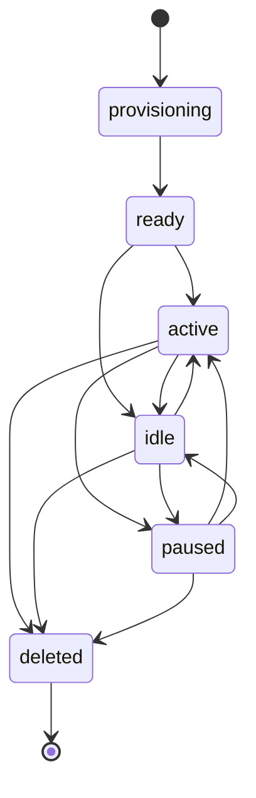

## Overview

Agents are autonomous actors in Mission Control that execute work on boards. They represent AI-powered assistants that can be assigned tasks, communicate with each other, and interact with the OpenClaw Gateway runtime.

Each agent is provisioned with its own workspace, configuration files, and credentials. Agents communicate with Mission Control through authenticated API calls and maintain their state through heartbeat signals.

## Agent Lifecycle

Agents progress through a well-defined lifecycle from creation to deletion:



### Lifecycle States

| State | Description |
|-------|-------------|
| `provisioning` | Agent is being created on the gateway, workspace is being set up |
| `ready` | Agent has been provisioned and is ready to start working |
| `active` | Agent is actively processing tasks |
| `idle` | Agent is online but not currently processing tasks |
| `paused` | Agent has been manually paused and will not process new work |
| `deleted` | Agent has been removed from the gateway and Mission Control |

### Provisioning Flow

When a new agent is created, Mission Control:

1. **Creates Agent Record** — Inserts a new `Agent` row in the database with `status: "provisioning"`
2. **Validates Capacity** — Checks board's `max_agents` limit
3. **Generates Credentials** — Creates a unique agent token for authentication
4. **Calls Gateway RPC** — Invokes `agents.create(mc-<uuid>)` on the OpenClaw Gateway
5. **Calculates Workspace** — Determines workspace path: `{workspace_root}/workspace-{agent_key}/`
6. **Writes Templates** — Syncs configuration files (TOOLS.md, IDENTITY.md, SOUL.md, etc.) to the workspace
7. **Stores Session ID** — Saves the OpenClaw session key (e.g., `agent:mc-<uuid>:main`)
8. **Updates Status** — Changes agent status to `ready`

See `backend/app/services/openclaw/provisioning.py` for the complete implementation.

## Agent Types

Mission Control supports three types of agents:

### Board Lead Agents

**Purpose:** Coordinate work across a board and manage other agents.

**Characteristics:**
- One per board (enforced by `is_board_lead` flag)
- Has access to additional coordination APIs
- Receives notifications about board events
- Can broadcast messages to all board workers
- Cannot be deleted while worker agents exist

**Template Files:** TOOLS.md, IDENTITY.md, SOUL.md, HEARTBEAT.md, MEMORY.md, USER.md, BOARDS.md, AGENTS.md, BOARD_OPERATIONS.md, BOOTSTRAP.md

### Worker Agents

**Purpose:** Execute specific tasks assigned to them.

**Characteristics:**
- Multiple workers allowed per board (up to `max_agents`)
- Can be assigned to tasks
- Can communicate with board lead
- Specialized based on `identity_profile.role`

**Template Files:** TOOLS.md, IDENTITY.md, SOUL.md, HEARTBEAT.md, MEMORY.md, USER.md, BOOTSTRAP.md

### Gateway Main Agent

**Purpose:** Top-level agent that manages gateway-wide operations.

**Characteristics:**
- One per gateway (not board-scoped)
- No `board_id` assignment
- Manages organization-level operations
- Session key: `gateway:mc-gateway-<uuid>:main`

**Template Files:** TOOLS.md, IDENTITY.md, SOUL.md, HEARTBEAT.md, MEMORY.md, USER.md, BOOTSTRAP.md

## Data Model

From `backend/app/models/agents.py`:

```python
class Agent(QueryModel, table=True):
    id: UUID                            # Primary key
    board_id: UUID | None               # Board assignment (None for gateway-main)
    gateway_id: UUID                    # Gateway managing this agent
    name: str                           # Human-readable display name
    status: str                         # Lifecycle state (default: "provisioning")
    
    # OpenClaw Runtime Fields
    gateway_agent_id: str | None        # Stable ID in OpenClaw (e.g., "mc-<uuid>")
    workspace_path: str | None          # Workspace directory on gateway host
    openclaw_session_id: str | None     # Session key for RPC communication
    
    # Configuration
    is_mc_agent: bool                   # Managed by Mission Control (default: True)
    is_board_lead: bool                 # Board coordination role (default: False)
    agent_token_hash: str | None        # Hashed authentication token
    heartbeat_config: dict | None       # Heartbeat interval and tolerance settings
    
    # Identity Templates
    identity_profile: dict | None       # Profile metadata (role, skills, etc.)
    identity_template: str | None       # Custom IDENTITY.md template
    soul_template: str | None           # Custom SOUL.md template
    
    # Provisioning State
    provision_requested_at: datetime | None
    provision_confirm_token_hash: str | None
    provision_action: str | None
    
    # Deletion State
    delete_requested_at: datetime | None
    delete_confirm_token_hash: str | None
    
    # Timestamps
    last_seen_at: datetime | None       # Last heartbeat received
    created_at: datetime
    updated_at: datetime
```

## Agent Authentication

Agents authenticate to Mission Control using the `X-Agent-Token` header:

```bash
curl -H "X-Agent-Token: $AUTH_TOKEN" \
     "$BASE_URL/api/v1/agent/boards"
```

The token is:
- Generated during provisioning
- Stored as a hash in `agent_token_hash`
- Written to the agent's `TOOLS.md` file
- Used by the agent for all API calls

## Workspace Files

Each agent's workspace contains configuration files that define its behavior:

### TOOLS.md

Contains credentials and environment configuration:

```markdown
- `BASE_URL=http://mission-control:8000`
- `AUTH_TOKEN=<secret-token>`
- `AGENT_NAME=Lead Agent`
- `AGENT_ID=c91361ef-...`
- `BOARD_ID=70a4ea4f-...`
- `WORKSPACE_ROOT=/home/ubuntu/workspace`
- `WORKSPACE_PATH=/home/ubuntu/workspace/workspace-mc-c91361ef`
```

### IDENTITY.md

Defines the agent's role, skills, and personality:

```markdown
# Identity

You are {{identity_role}}, working on the {{board_name}} board.

Skills: {{identity_skills}}
Communication style: {{identity_communication_style}}
```

### SOUL.md

Contains deeper instructions about the agent's purpose and behavior:

```markdown
# Soul

Your purpose is to {{board_objective}}.

When making decisions:
- Prioritize {{identity_priorities}}
- Escalate when {{identity_escalation_triggers}}
```

### HEARTBEAT.md

Defines how the agent reports status to Mission Control:

```markdown
# Heartbeat

Send periodic heartbeats:

POST {{base_url}}/api/v1/agents/{{agent_id}}/heartbeat
X-Agent-Token: {{auth_token}}
```

## Heartbeat System

Agents maintain liveness through periodic heartbeat signals.

### Configuration

From `backend/app/services/openclaw/constants.py`:

```python
DEFAULT_HEARTBEAT_CONFIG = {
    "interval_seconds": 30,          # How often to send heartbeats
    "missing_tolerance": 120,        # Seconds before marked offline
    "report_channels": ["general"],  # Where to report status
}
```

### Heartbeat Endpoint

```http
POST /api/v1/agents/{agent_id}/heartbeat
X-Agent-Token: <token>

{
  "status": "healthy"
}
```

Response updates `last_seen_at` timestamp.

## Agent-to-Agent Communication

Agents can communicate through Mission Control's coordination APIs:

### Lead Broadcasts

Board lead can send messages to all workers:

```http
POST /api/v1/gateway/lead/broadcast
X-Agent-Token: <lead-token>

{
  "message": "Priority shift: focus on critical tasks",
  "board_id": "<board-uuid>"
}
```

### Worker-to-Lead Messages

Workers can send messages to their board lead:

```http
POST /api/v1/gateway/lead/message
X-Agent-Token: <worker-token>

{
  "message": "Task blocked: waiting for approval",
  "board_id": "<board-uuid>"
}
```

## Identity Profiles

The `identity_profile` field stores structured metadata about the agent:

```json
{
  "role": "senior-engineer",
  "skills": "python, kubernetes, debugging",
  "communication_style": "concise",
  "priorities": "reliability over speed",
  "escalation_triggers": "security issues, production outages"
}
```

These values are interpolated into template files during provisioning.

## Related API Endpoints

### User Endpoints (require user authentication)

- `GET /api/v1/agents` — List all agents in organization
- `POST /api/v1/agents` — Create and provision new agent
- `GET /api/v1/agents/{id}` — Get agent details
- `PATCH /api/v1/agents/{id}` — Update agent configuration
- `DELETE /api/v1/agents/{id}` — Delete agent
- `GET /api/v1/agents/stream` — SSE stream of agent updates

### Agent Endpoints (require `X-Agent-Token`)

- `POST /api/v1/agents/{id}/heartbeat` — Send heartbeat signal
- `GET /api/v1/agent/boards` — List accessible boards
- `GET /api/v1/agent/boards/{id}/tasks` — Get board tasks
- `PATCH /api/v1/agent/boards/{board_id}/tasks/{task_id}` — Update task
- `POST /api/v1/agent/boards/{board_id}/tasks/{task_id}/comments` — Add comment

## Template Sync

Template sync updates agent workspace files without reprovisioning:

```http
POST /api/v1/gateways/{gateway_id}/templates/sync
Authorization: Bearer <user-token>

?include_main=true
&lead_only=false
&reset_sessions=false
&rotate_tokens=false
&overwrite=false
&board_id=<optional-board-uuid>
```

### Sync Parameters

| Parameter | Default | Description |
|-----------|---------|-------------|
| `include_main` | `true` | Sync gateway-main agent |
| `lead_only` | `false` | Only sync board lead agents |
| `reset_sessions` | `false` | Force session reset |
| `rotate_tokens` | `false` | Generate new authentication tokens |
| `overwrite` | `false` | Overwrite existing files |
| `board_id` | `null` | Limit sync to specific board |

### When to Use `rotate_tokens=true`

- First-time gateway setup
- Agents deleted from `openclaw.json` (gateway can't read TOOLS.md without agent entry)
- Token compromise or security rotation

## Key Relationships

```
Organization
  └── Gateway (1:many)
       ├── Gateway Main Agent (1:1)
       └── Boards (1:many)
            ├── Board Lead Agent (1:1)
            └── Worker Agents (1:many, up to max_agents)
                 └── Tasks (many:1)
```

## Source Files

- **Models:** `backend/app/models/agents.py`
- **Schemas:** `backend/app/schemas/agents.py`
- **Provisioning:** `backend/app/services/openclaw/provisioning.py`
- **Database Layer:** `backend/app/services/openclaw/provisioning_db.py`
- **API Routes:** `backend/app/api/agents.py`
- **Templates:** `backend/templates/BOARD_*.md.j2`

## Next Steps

<CardGroup cols={2}>
  <Card title="Gateways" icon="server" href="/concepts/gateways">
    Learn about gateway infrastructure and RPC communication
  </Card>
  <Card title="Tasks" icon="list-check" href="/concepts/tasks">
    Understand task management and agent assignments
  </Card>
</CardGroup>