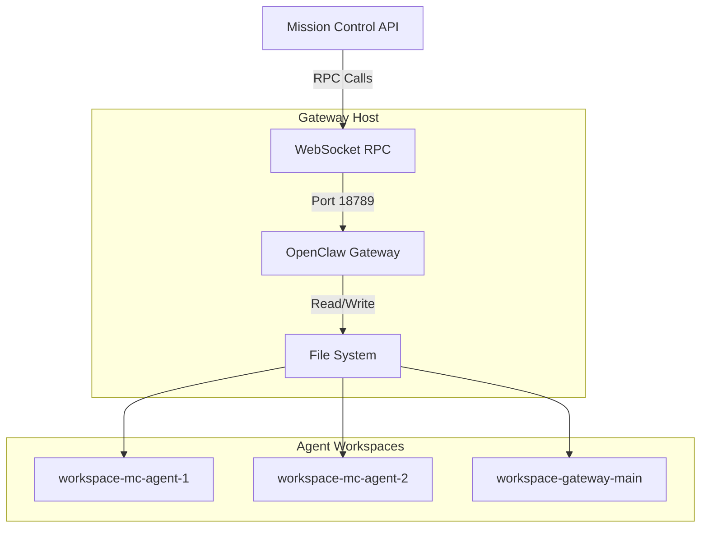

## Overview

Gateways are the bridge between Mission Control and the OpenClaw agent runtime. Each gateway represents a running OpenClaw instance that hosts and manages agent workspaces. Mission Control communicates with gateways through a WebSocket-based RPC protocol to provision agents, sync configuration files, and send messages.

## Architecture



## Data Model

From `backend/app/models/gateways.py`:

```python
class Gateway(QueryModel, table=True):
    id: UUID                            # Primary key
    organization_id: UUID               # Organization that owns this gateway
    name: str                           # Human-readable gateway name
    url: str                            # WebSocket endpoint (e.g., ws://host:18789)
    token: str | None                   # Optional authentication token
    
    # OpenClaw Runtime Fields
    gateway_agent_id: str | None        # Main agent ID (e.g., "mc-gateway-<uuid>")
    workspace_root: str                 # Base directory for agent workspaces
    
    # Connection Settings
    disable_device_pairing: bool        # Skip device pairing flow (default: False)
    allow_insecure_tls: bool            # Allow self-signed certificates (default: False)
    
    # Timestamps
    created_at: datetime
    updated_at: datetime
```

## Gateway Types

Mission Control supports two deployment patterns:

### Self-Hosted Gateway

**Use Case:** Development, testing, or single-organization deployments.

**Characteristics:**
- Runs on the same host as Mission Control
- Direct file system access to workspaces
- Typically uses `disable_device_pairing: true`
- Example URL: `ws://localhost:18789`

**Configuration:**

```json
// ~/.openclaw/openclaw.json
{
  "gateway": {
    "controlUi": {
      "allowInsecureAuth": true,
      "dangerouslyDisableDeviceAuth": true
    }
  }
}
```

### Remote Gateway

**Use Case:** Production deployments, multi-tenant scenarios.

**Characteristics:**
- Runs on separate infrastructure
- Requires network-accessible WebSocket endpoint
- Uses standard device pairing flow
- Example URL: `wss://gateway.example.com:18789`

**Configuration:**

```json
// ~/.openclaw/openclaw.json
{
  "gateway": {
    "port": 18789,
    "tls": {
      "enabled": true,
      "certPath": "/path/to/cert.pem",
      "keyPath": "/path/to/key.pem"
    }
  }
}
```

## RPC Communication

Mission Control communicates with gateways using a JSON-RPC style protocol over WebSockets.

### Connection Flow

1. **Open WebSocket** — Connect to gateway URL (default port: 18789)
2. **Authenticate** — Send control UI authentication (if `disable_device_pairing: true`)
3. **Call Methods** — Send RPC requests, receive responses
4. **Handle Errors** — Retry with exponential backoff on connection failures

Implementation: `backend/app/services/openclaw/gateway_rpc.py`

### RPC Methods

Mission Control uses these OpenClaw gateway methods:

#### Agent Management

```python
# Create agent
await openclaw_call("agents.create", {
    "name": "mc-<uuid>",
    "workspace": "/path/to/workspace"
})

# Update agent
await openclaw_call("agents.update", {
    "agentId": "mc-<uuid>",
    "name": "Lead Agent",
    "workspace": "/path/to/workspace"
})

# Delete agent
await openclaw_call("agents.delete", {
    "agentId": "mc-<uuid>",
    "deleteFiles": true
})
```

#### File Operations

```python
# List files in agent workspace
await openclaw_call("agents.files.list", {
    "agentId": "mc-<uuid>"
})

# Read file
await openclaw_call("agents.files.get", {
    "agentId": "mc-<uuid>",
    "name": "TOOLS.md"
})

# Write file
await openclaw_call("agents.files.set", {
    "agentId": "mc-<uuid>",
    "name": "TOOLS.md",
    "content": "# Tools\n..."
})

# Delete file
await openclaw_call("agents.files.delete", {
    "agentId": "mc-<uuid>",
    "name": "OLD_FILE.md"
})
```

#### Session Management

```python
# Ensure session exists
await ensure_session(
    session_key="agent:mc-<uuid>:main",
    label="Lead Agent"
)

# Reset session
await openclaw_call("sessions.reset", {
    "key": "agent:mc-<uuid>:main"
})

# Delete session
await openclaw_call("sessions.delete", {
    "key": "agent:mc-<uuid>:main"
})

# Send message to session
await send_message(
    message="Hello, agent!",
    session_key="agent:mc-<uuid>:main",
    deliver=True  # Triggers agent processing
)
```

#### Configuration Management

```python
# Get gateway config
config = await openclaw_call("config.get")

# Patch agent heartbeat settings
await openclaw_call("config.patch", {
    "raw": json.dumps({
        "agents": {
            "list": [
                {
                    "id": "mc-<uuid>",
                    "workspace": "/path/to/workspace",
                    "heartbeat": {
                        "interval_seconds": 30,
                        "missing_tolerance": 120
                    }
                }
            ]
        }
    }),
    "baseHash": config["hash"]  # Optimistic concurrency control
})
```

#### Health Check

```python
# Check gateway health
status = await openclaw_call("health")
```

### Error Handling

The RPC client implements retry logic with exponential backoff:

```python
class GatewayConfig:
    url: str
    token: str | None
    allow_insecure_tls: bool = False
    disable_device_pairing: bool = False
    max_retries: int = 3
    initial_backoff: float = 1.0
    max_backoff: float = 30.0
```

Common errors:

| Error | Meaning | Resolution |
|-------|---------|------------|
| `Connection refused` | Gateway not running | Start OpenClaw gateway |
| `missing scope: operator.read` | Auth disabled | Set `dangerouslyDisableDeviceAuth: true` |
| `unknown agent` | Agent doesn't exist | Create agent first |
| `not found` | Session/file missing | Create or sync resources |

## Workspace Structure

Each agent gets its own workspace directory:

```
{workspace_root}/
├── workspace-mc-agent-1/
│   ├── TOOLS.md
│   ├── IDENTITY.md
│   ├── SOUL.md
│   ├── HEARTBEAT.md
│   ├── MEMORY.md
│   ├── USER.md
│   └── BOOTSTRAP.md
├── workspace-mc-agent-2/
│   └── ...
└── workspace-gateway-main/
    └── ...
```

### Workspace Path Calculation

From `backend/app/services/openclaw/provisioning.py:_workspace_path()`:

```python
def _workspace_path(agent: Agent, workspace_root: str) -> str:
    root = workspace_root.rstrip("/")
    key = _agent_key(agent)  # Extracts from session_id
    
    # Backwards compatibility for gateway-main
    if key.startswith("mc-gateway-"):
        key = key.removeprefix("mc-")
    
    return f"{root}/workspace-{slugify(key)}"
```

**Example:**
- `workspace_root`: `/home/ubuntu/workspaces`
- `agent_key`: `mc-e595d5d1-6d85-439c-82e1-8f388a302e6a`
- **Result:** `/home/ubuntu/workspaces/workspace-mc-e595d5d1-6d85-439c-82e1-8f388a302e6a`

## Template Sync

Template sync updates agent workspace files across the gateway.

### Sync Endpoint

```http
POST /api/v1/gateways/{gateway_id}/templates/sync
Authorization: Bearer <user-token>

# Query Parameters:
?include_main=true          # Sync gateway-main agent
&lead_only=false            # Only sync board leads
&reset_sessions=false       # Force session reset
&rotate_tokens=false        # Generate new auth tokens
&overwrite=false            # Overwrite existing files
&force_bootstrap=false      # Force BOOTSTRAP.md write
&board_id=<uuid>           # Limit to specific board
```

### Sync Flow

Implementation: `backend/app/services/openclaw/admin_service.py`

1. **Query Agents** — Load agents from database for the gateway
2. **Filter Scope** — Apply `board_id`, `lead_only`, `include_main` filters
3. **Read Tokens** — Try to read existing `AUTH_TOKEN` from TOOLS.md
4. **Render Templates** — Generate files from Jinja2 templates
5. **Write Files** — Call `agents.files.set` for each template
6. **Update Heartbeats** — Patch gateway config with new heartbeat settings
7. **Return Results** — Summary of updates, skips, and errors

### Sync Response

```json
{
  "gateway_id": "55cc268a-4b45-400f-accf-201e025232ac",
  "include_main": true,
  "reset_sessions": false,
  "agents_updated": 5,
  "agents_skipped": 0,
  "main_updated": true,
  "errors": [
    {
      "agent_id": "c91361ef-...",
      "agent_name": "Worker Agent",
      "board_id": "70a4ea4f-...",
      "message": "unable to read AUTH_TOKEN from TOOLS.md (run with rotate_tokens=true)"
    }
  ]
}
```

### When to Rotate Tokens

Use `rotate_tokens=true` when:

1. **First Setup** — Initial gateway configuration
2. **Agent Config Lost** — Agents deleted from `openclaw.json`
3. **Cannot Read TOOLS.md** — Gateway returns "not found" or "unknown agent"
4. **Security Rotation** — Periodic token refresh

**Why?** The gateway cannot serve files for agents that don't exist in its config. If an agent entry is missing, Mission Control can't read the existing token, so it must generate a new one and recreate the agent entry.

## Device Pairing

Standard OpenClaw gateways require device pairing for control UI access.

### Bypassing Device Pairing

For Mission Control integration, set `disable_device_pairing: true` in the gateway record and configure:

```json
// ~/.openclaw/openclaw.json
{
  "gateway": {
    "controlUi": {
      "allowInsecureAuth": true,
      "dangerouslyDisableDeviceAuth": true
    }
  }
}
```

**Security Note:** Only use `dangerouslyDisableDeviceAuth` on trusted networks or with additional authentication layers.

### With Device Pairing

For production deployments:

1. Set `disable_device_pairing: false` in Mission Control
2. Complete device pairing flow through OpenClaw UI
3. Store the device token in Mission Control's `token` field
4. Mission Control uses the device token for RPC authentication

## Gateway Main Agent

Each gateway has a special "main" agent for organization-level operations.

### Characteristics

- **One per gateway** (not board-scoped)
- **No `board_id`** (organization-level)
- **Session key:** `gateway:mc-gateway-<uuid>:main`
- **Agent ID:** `mc-gateway-<uuid>`
- **Workspace:** `{workspace_root}/workspace-gateway-<uuid>`

### Creation

The gateway-main agent is automatically created when a gateway is first registered:

```python
# POST /api/v1/gateways
{
  "name": "Production Gateway",
  "url": "ws://gateway.example.com:18789",
  "workspace_root": "/home/openclaw/workspaces",
  "disable_device_pairing": true
}

# Response includes gateway_agent_id
{
  "id": "55cc268a-...",
  "gateway_agent_id": "mc-gateway-55cc268a-...",
  ...
}
```

See `backend/app/services/openclaw/admin_service.py:create_gateway()` for implementation.

## Version Compatibility

Mission Control enforces minimum gateway version requirements:

```python
# backend/app/core/config.py
GATEWAY_MIN_VERSION = "2026.02.9"
```

Check: `backend/app/services/openclaw/gateway_compat.py`

If a gateway is running an older version, provisioning and sync operations will fail with a version mismatch error.

## Related API Endpoints

### Gateway Management

- `GET /api/v1/gateways` — List all gateways
- `POST /api/v1/gateways` — Create gateway (provisions main agent)
- `GET /api/v1/gateways/{id}` — Get gateway details
- `PATCH /api/v1/gateways/{id}` — Update gateway configuration
- `DELETE /api/v1/gateways/{id}` — Delete gateway

### Template Operations

- `POST /api/v1/gateways/{id}/templates/sync` — Sync templates to agents

### Runtime Operations

- `GET /api/v1/gateway/status` — Gateway health status
- `GET /api/v1/gateway/sessions` — Active sessions
- `GET /api/v1/gateway/sessions/{id}` — Session details
- `GET /api/v1/gateway/sessions/{id}/history` — Chat history
- `POST /api/v1/gateway/sessions/{id}/message` — Send message to session

## Troubleshooting

### "missing scope: operator.read"

**Cause:** Gateway doesn't have `dangerouslyDisableDeviceAuth` enabled.

**Fix:**

```json
// ~/.openclaw/openclaw.json
{
  "gateway": {
    "controlUi": {
      "allowInsecureAuth": true,
      "dangerouslyDisableDeviceAuth": true
    }
  }
}
```

Restart the gateway after configuration changes.

### "unable to read AUTH_TOKEN from TOOLS.md"

**Cause:** Agent doesn't exist in gateway config (deleted from `openclaw.json`).

**Fix:** Run template sync with token rotation:

```bash
curl -X POST \
  "$BASE_URL/api/v1/gateways/$GATEWAY_ID/templates/sync?rotate_tokens=true&overwrite=true" \
  -H "Authorization: Bearer $TOKEN"
```

### Connection Refused

**Cause:** Gateway not running or wrong URL.

**Fix:**

1. Check gateway is running: `ps aux | grep openclaw`
2. Verify URL in gateway record matches actual endpoint
3. Check firewall rules allow WebSocket connections on port 18789

## Source Files

- **Models:** `backend/app/models/gateways.py`
- **Schemas:** `backend/app/schemas/gateways.py`
- **RPC Client:** `backend/app/services/openclaw/gateway_rpc.py`
- **Admin Service:** `backend/app/services/openclaw/admin_service.py`
- **Provisioning:** `backend/app/services/openclaw/provisioning.py`
- **API Routes:** `backend/app/api/gateways.py`, `backend/app/api/gateway_api.py`

## Next Steps

<CardGroup cols={2}>
  <Card title="Agents" icon="robot" href="/concepts/agents">
    Learn how agents are provisioned and managed through gateways
  </Card>
  <Card title="Tasks" icon="list-check" href="/concepts/tasks">
    Understand how agents execute work through task assignments
  </Card>
</CardGroup>