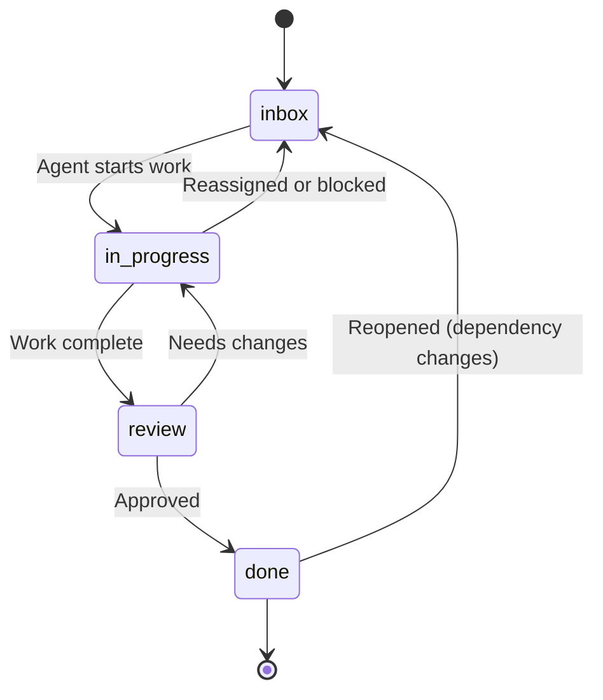
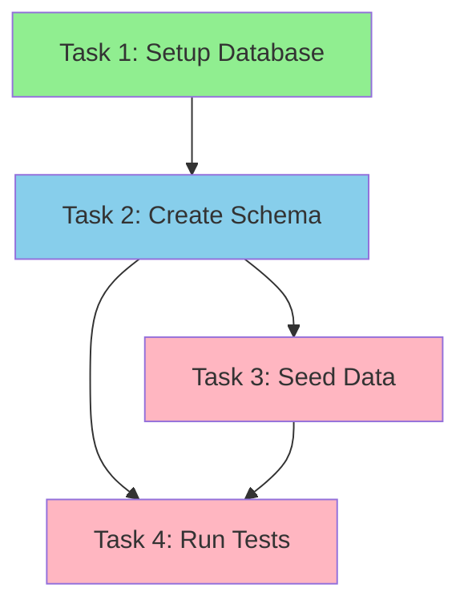

## Overview

Tasks are the fundamental work units in Mission Control. They represent actionable items that can be assigned to agents, tracked through various states, and organized with dependencies. Tasks belong to boards and flow through a defined lifecycle as agents work on them.

## Data Model

From `backend/app/models/tasks.py`:

```python
class Task(TenantScoped, table=True):
    id: UUID                            # Primary key
    board_id: UUID | None               # Board this task belongs to
    
    # Content
    title: str                          # Task title (required)
    description: str | None             # Detailed description (optional)
    
    # Status & Priority
    status: str                         # Current state (default: "inbox")
    priority: str                       # Urgency level (default: "medium")
    
    # Timing
    due_at: datetime | None             # Optional deadline
    in_progress_at: datetime | None     # When status changed to "in_progress"
    previous_in_progress_at: datetime | None  # Last time it was in progress
    
    # Ownership
    created_by_user_id: UUID | None     # User who created the task
    assigned_agent_id: UUID | None      # Agent currently assigned
    
    # Automation Flags
    auto_created: bool                  # Created by system (default: False)
    auto_reason: str | None             # Why it was auto-created
    
    # Timestamps
    created_at: datetime
    updated_at: datetime
```

## Task States

Tasks progress through four primary states:



### State Definitions

From `backend/app/schemas/tasks.py`:

```python
TaskStatus = Literal["inbox", "in_progress", "review", "done"]
```

| State | Description | Rules |
|-------|-------------|---------|
| `inbox` | Task is queued, not yet started | Default state for new tasks |
| `in_progress` | Agent is actively working on the task | Sets `in_progress_at` timestamp; cannot transition if blocked by dependencies |
| `review` | Work complete, awaiting review | Optional intermediate state before `done` |
| `done` | Task is complete | May require approval; reopened if dependencies change |

### State Transition Rules

#### Moving to `in_progress`

**Blocked Check:**

```python
# From backend/app/api/tasks.py
blocked_by = blocked_by_dependency_ids(
    dependency_ids=dependency_task_ids,
    status_by_id=status_by_id
)

if blocked_by and (task.assigned_agent_id is not None or task.status != "inbox"):
    raise HTTPException(
        status_code=422,
        detail={
            "message": "Task is blocked by incomplete dependencies.",
            "code": "task_blocked_cannot_transition",
            "blocked_by_task_ids": [str(id) for id in blocked_by]
        }
    )
```

A task cannot move to `in_progress` if any of its dependencies are not in `done` state.

#### Moving to `done`

**Approval Required:**

If `board.require_approval_for_done` is `true`, the task must have an approved linked approval before transitioning to `done`.

```python
# From backend/app/api/tasks.py
if target_status == "done" and board.require_approval_for_done:
    approval = await get_linked_approval(task_id)
    if not approval or approval.status != "approved":
        raise HTTPException(
            status_code=422,
            detail={
                "message": "Task can only be marked done when a linked approval has been approved.",
                "code": "approval_required_for_done"
            }
        )
```

**Review Required:**

If `board.require_review_before_done` is `true`, the task must transition through `review` state before `done`.

```python
if target_status == "done" and previous_status != "review" and board.require_review_before_done:
    raise HTTPException(
        status_code=422,
        detail={
            "message": "Task can only be marked done from review when the board rule is enabled.",
            "code": "review_required_before_done"
        }
    )
```

#### Reopening Done Tasks

When a dependency task is reopened (moved from `done` to any other state), all dependent tasks in `done` state are automatically returned to `inbox`:

```python
# From backend/app/api/tasks.py
reopened = previous_status == "done" and dependency_task.status != "done"

if reopened:
    dependent_tasks = await query_dependent_tasks(dependency_task_id)
    
    for dependent in dependent_tasks:
        if dependent.status == "done":
            # Return to inbox, clear progress timestamp
            dependent.status = "inbox"
            dependent.in_progress_at = None
            
            # Notify board lead
            await send_lead_notification(
                message=f"Task returned to inbox: dependency reopened ({dependency_task.title})."
            )
```

## Task Dependencies

Tasks can depend on other tasks within the same board.

### Dependency Model

From `backend/app/models/task_dependencies.py`:

```python
class TaskDependency(TenantScoped, table=True):
    id: UUID                            # Primary key
    board_id: UUID                      # Board (for tenant scoping)
    task_id: UUID                       # Dependent task
    depends_on_task_id: UUID            # Blocking task
    created_at: datetime
    
    # Constraints:
    # - Unique pair (task_id, depends_on_task_id)
    # - Cannot depend on self (task_id != depends_on_task_id)
```

### Dependency Graph



In this example:
- **Task 1** (done) has no dependencies
- **Task 2** (in_progress) depends on Task 1
- **Task 3** (inbox) depends on Task 2 — **blocked**
- **Task 4** (inbox) depends on Tasks 2 and 3 — **blocked**

### Blocking Logic

From `backend/app/services/task_dependencies.py`:

```python
DONE_STATUS: Final[str] = "done"

def blocked_by_dependency_ids(
    dependency_ids: Collection[UUID],
    status_by_id: Mapping[UUID, str],
) -> list[UUID]:
    """Return dependency IDs that are not yet in the done status."""
    return [
        dep_id
        for dep_id in dependency_ids
        if status_by_id.get(dep_id) != DONE_STATUS
    ]
```

A task is **blocked** if any of its dependencies are not in `done` state.

### Creating Dependencies

```http
POST /api/v1/tasks/{task_id}/dependencies
Authorization: Bearer <token>

{
  "depends_on_task_id": "<blocking-task-uuid>"
}
```

Alternatively, specify dependencies when creating a task:

```http
POST /api/v1/tasks
Authorization: Bearer <token>

{
  "title": "Implement feature",
  "board_id": "<board-uuid>",
  "depends_on_task_ids": [
    "<task-1-uuid>",
    "<task-2-uuid>"
  ]
}
```

## Task Assignment

Tasks can be assigned to agents for execution.

### Assigning Agents

```http
PATCH /api/v1/tasks/{task_id}
Authorization: Bearer <token>

{
  "assigned_agent_id": "<agent-uuid>"
}
```

Or use the dedicated assignment endpoint:

```http
POST /api/v1/tasks/{task_id}/assign-agent
Authorization: Bearer <token>

{
  "agent_id": "<agent-uuid>"
}
```

### Assignment Rules

1. **Board Scope:** Agent must belong to the same board as the task
2. **Agent Status:** Agent must be in `ready`, `active`, or `idle` state (not `provisioning`, `paused`, or `deleted`)
3. **Capacity:** Board's `max_agents` limit is enforced at provisioning time, not assignment time

### Auto-Assignment

Board lead agents can implement auto-assignment logic by:

1. Querying unassigned tasks: `GET /api/v1/agent/boards/{board_id}/tasks?assigned_agent_id=null`
2. Selecting appropriate worker agents: `GET /api/v1/agent/boards/{board_id}/agents`
3. Updating task assignments: `PATCH /api/v1/agent/boards/{board_id}/tasks/{task_id}`

## Task Priority

Priority is a string field with common values:

- `low`
- `medium` (default)
- `high`
- `urgent`

Priority is informational; Mission Control does not enforce any ordering based on priority. Agents can query tasks filtered or sorted by priority to implement their own prioritization logic.

## Task Metadata

### Tags

Tasks can be labeled with tags for organization:

```http
PATCH /api/v1/tasks/{task_id}
Authorization: Bearer <token>

{
  "tag_ids": [
    "<tag-1-uuid>",
    "<tag-2-uuid>"
  ]
}
```

Tags are organization-scoped and can be used for filtering:

```http
GET /api/v1/tasks?tag_ids=<tag-uuid>&tag_ids=<tag-uuid>
```

### Custom Fields

Boards can define custom fields for tasks:

```http
PATCH /api/v1/tasks/{task_id}
Authorization: Bearer <token>

{
  "custom_field_values": {
    "severity": "critical",
    "customer_impact": "high",
    "estimated_hours": 8
  }
}
```

Custom fields are defined at the organization level and can be attached to specific boards.

## Task Comments

Agents and users can add comments to tasks:

```http
POST /api/v1/tasks/{task_id}/comments
Authorization: Bearer <token>

{
  "message": "Work in progress, encountered blocker with API integration."
}
```

Or include a comment with a task update:

```http
PATCH /api/v1/tasks/{task_id}
Authorization: Bearer <token>

{
  "status": "in_progress",
  "comment": "Starting work on this task."
}
```

## Task Read Model

From `backend/app/schemas/tasks.py`:

```python
class TaskRead(TaskBase):
    id: UUID
    board_id: UUID | None
    created_by_user_id: UUID | None
    in_progress_at: datetime | None
    created_at: datetime
    updated_at: datetime
    
    # Computed fields
    blocked_by_task_ids: list[UUID] = Field(default_factory=list)
    is_blocked: bool = False
    
    # Metadata
    tags: list[TagRef] = Field(default_factory=list)
    custom_field_values: dict | None = None
```

The `blocked_by_task_ids` field is computed at read time by querying dependencies and checking their status.

## Related API Endpoints

### Task Management

- `GET /api/v1/tasks` — List all tasks (with filters)
- `POST /api/v1/tasks` — Create task
- `GET /api/v1/tasks/{id}` — Get task details
- `PATCH /api/v1/tasks/{id}` — Update task
- `DELETE /api/v1/tasks/{id}` — Delete task
- `GET /api/v1/tasks/stream` — SSE stream of task updates

### Board Tasks

- `GET /api/v1/boards/{board_id}/tasks` — List tasks for a board

### Dependencies

- `GET /api/v1/tasks/{id}/dependencies` — List task dependencies
- `POST /api/v1/tasks/{id}/dependencies` — Create dependency
- `DELETE /api/v1/tasks/{task_id}/dependencies/{dependency_id}` — Remove dependency

### Comments

- `GET /api/v1/tasks/{id}/comments` — List task comments
- `POST /api/v1/tasks/{id}/comments` — Add comment

### Assignment

- `POST /api/v1/tasks/{id}/assign-agent` — Assign agent to task

### Agent Endpoints (require `X-Agent-Token`)

- `GET /api/v1/agent/boards/{board_id}/tasks` — Get tasks for board
- `PATCH /api/v1/agent/boards/{board_id}/tasks/{task_id}` — Update task
- `POST /api/v1/agent/boards/{board_id}/tasks/{task_id}/comments` — Add comment

## Query Filters

The task list endpoint supports extensive filtering:

```http
GET /api/v1/tasks?
  board_id=<uuid>&
  status=in_progress&
  status=review&
  assigned_agent_id=<uuid>&
  created_by_user_id=<uuid>&
  priority=high&
  tag_ids=<uuid>&
  include_done=false&
  limit=50&
  offset=0
```

### Common Query Patterns

**Unassigned tasks:**
```http
GET /api/v1/tasks?board_id=<uuid>&assigned_agent_id=null&status=inbox
```

**Active work:**
```http
GET /api/v1/tasks?board_id=<uuid>&status=in_progress
```

**Overdue tasks:**
```http
GET /api/v1/tasks?board_id=<uuid>&due_before=2026-03-05T00:00:00Z&status=inbox&status=in_progress
```

**Blocked tasks:**
```http
GET /api/v1/tasks?board_id=<uuid>&is_blocked=true
```

## Board Rules

Boards can enforce workflow rules that affect task transitions:

### Approval Rules

```python
class Board:
    require_approval_for_done: bool = True        # Require approval link
    require_review_before_done: bool = False      # Must go through review
    block_status_changes_with_pending_approval: bool = True  # Lock during approval
```

See `backend/app/models/boards.py` for full board configuration.

### Lead-Only Status Changes

```python
class Board:
    only_lead_can_change_status: bool = False
```

When `true`, only the board lead agent can change task status. Worker agents can still add comments and update other fields.

## Metrics

Task metrics are available for boards and board groups:

```http
GET /api/v1/metrics/boards/{board_id}
```

Response:

```json
{
  "board_id": "70a4ea4f-...",
  "task_counts": {
    "inbox": 5,
    "in_progress": 3,
    "review": 1,
    "done": 12
  },
  "tasks_by_agent": {
    "c91361ef-...": 2,
    "e595d5d1-...": 1
  },
  "overdue_count": 1,
  "blocked_count": 2
}
```

## Activity Feed

Task changes are logged to the activity feed:

```http
GET /api/v1/activity?board_id=<uuid>
```

Events include:
- `task.created`
- `task.updated` (with field diff)
- `task.status_changed`
- `task.assigned`
- `task.commented`
- `task.dependency_added`
- `task.dependency_removed`

## Real-Time Updates

Subscribe to task changes via Server-Sent Events:

```http
GET /api/v1/tasks/stream?board_id=<uuid>
Authorization: Bearer <token>
```

Stream format:

```
event: task.updated
data: {"task": {...}, "changes": {...}}

event: task.status_changed
data: {"task": {...}, "previous_status": "inbox", "new_status": "in_progress"}
```

## Source Files

- **Models:** `backend/app/models/tasks.py`, `backend/app/models/task_dependencies.py`
- **Schemas:** `backend/app/schemas/tasks.py`
- **API Routes:** `backend/app/api/tasks.py`
- **Dependency Logic:** `backend/app/services/task_dependencies.py`
- **Snapshot Service:** `backend/app/services/board_snapshot.py`

## Next Steps

<CardGroup cols={2}>
  <Card title="Agents" icon="robot" href="/concepts/agents">
    Learn how agents are assigned to tasks and execute work
  </Card>
  <Card title="Gateways" icon="server" href="/concepts/gateways">
    Understand the infrastructure that connects agents to Mission Control
  </Card>
</CardGroup>