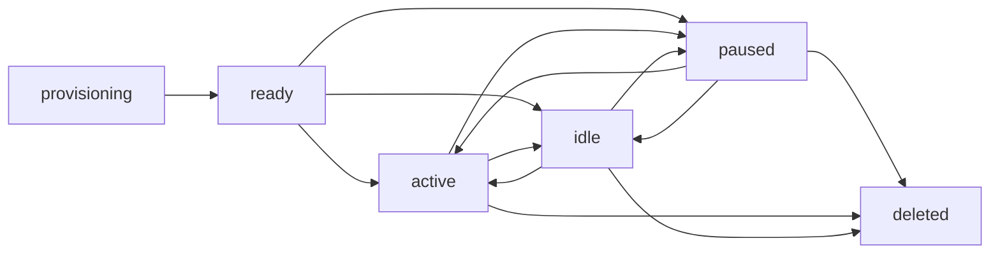

# Agent Provisioning

Agents are the autonomous workers that execute tasks on boards. Mission Control handles their lifecycle from creation to deletion.

## Prerequisites

- Active organization with boards
- Gateway configured with `workspace_root`
- Gateway main agent provisioned

## Agent Types

### Board Lead Agent

One per board, orchestrates other agents:

```json
{
  "name": "Lead Agent",
  "board_id": "<board-id>",
  "is_board_lead": true,
  "identity_profile": {
    "role": "Project Manager",
    "expertise": ["coordination", "planning"],
    "communication_style": "Clear and directive"
  }
}
```

### Board Worker Agent

Specialized agents for specific tasks:

```json
{
  "name": "Backend Engineer",
  "board_id": "<board-id>",
  "is_board_lead": false,
  "identity_profile": {
    "role": "Backend Developer",
    "expertise": ["Python", "FastAPI", "PostgreSQL"],
    "communication_style": "Technical and precise"
  }
}
```

### Gateway Main Agent

One per gateway, manages gateway-level operations:

```json
{
  "name": "Gateway Agent",
  "gateway_id": "<gateway-id>",
  "board_id": null
}
```

## Create an Agent

<Steps>
  <Step title="Prepare agent configuration">
    Define the agent's identity and role:
    ```json
    {
      "name": "DevOps Engineer",
      "board_id": "<board-id>",
      "is_board_lead": false,
      "identity_profile": {
        "role": "DevOps Engineer",
        "expertise": ["Kubernetes", "CI/CD", "monitoring"],
        "tone": "professional",
        "communication_style": "Proactive and detail-oriented"
      },
      "heartbeat_config": {
        "enabled": true,
        "intervalSeconds": 300
      }
    }
    ```
  </Step>
  
  <Step title="Send create request">
    ```bash
    curl -X POST http://localhost:8000/api/v1/agents \
      -H "Authorization: Bearer $TOKEN" \
      -H "Content-Type: application/json" \
      -d @agent-config.json
    ```
  </Step>
  
  <Step title="Agent provisioning begins">
    Mission Control:
    1. Creates agent record (status: `provisioning`)
    2. Generates workspace path: `{workspace_root}/workspace-mc-{uuid}`
    3. Calls gateway RPC: `agents.create(mc-{uuid})`
    4. Generates auth token and stores hash in database
    5. Renders templates (TOOLS.md, IDENTITY.md, SOUL.md, etc.)
    6. Writes files to agent workspace via `agents.files.set`
    7. Updates agent status to `ready`
    8. Sends wakeup message to agent session
  </Step>
</Steps>

**Source:** `backend/app/api/agents.py:98-106`, `backend/app/services/openclaw/provisioning_db.py`

## Provisioning Workflow

The provisioning process is handled by `OpenClawGatewayProvisioner`:

### Session Key Generation

Each agent gets a deterministic session key:

```python
def _session_key(agent: Agent) -> str:
    if agent.is_board_lead and agent.board_id is not None:
        return board_lead_session_key(agent.board_id)
    return board_agent_session_key(agent.id)

# Examples:
# Lead: "agent:lead:board-70a4ea4f-...:main"
# Worker: "agent:mc-c91361ef-...:main"
```

**Source:** `backend/app/services/openclaw/provisioning.py:377-386`

### Workspace Path

Agents get isolated workspace directories:

```python
def _workspace_path(agent: Agent, workspace_root: str) -> str:
    root = workspace_root.rstrip("/")
    key = _agent_key(agent)
    return f"{root}/workspace-{slugify(key)}"

# Example:
# /home/ubuntu/GDRIVE/moltbot/workspace-mc-c91361ef-6d85-439c-82e1-8f388a302e6a
```

**Source:** `backend/app/services/openclaw/provisioning.py:147-161`

### Template Rendering

Templates are rendered with Jinja2:

**Context variables:**
```python
{
    "agent_name": "DevOps Engineer",
    "agent_id": "c91361ef-...",
    "board_id": "70a4ea4f-...",
    "board_name": "Infrastructure",
    "board_type": "workflow",
    "board_objective": "Maintain production systems",
    "is_board_lead": "false",
    "session_key": "agent:mc-c91361ef-...:main",
    "workspace_path": "/home/ubuntu/GDRIVE/.../workspace-mc-c91361ef-...",
    "base_url": "http://72.62.201.147:8000",
    "auth_token": "<generated-token>",
    "identity_role": "DevOps Engineer",
    "identity_expertise": "Kubernetes, CI/CD, monitoring",
    "identity_tone": "professional"
}
```

**Source:** `backend/app/services/openclaw/provisioning.py:306-351`

### Template Files

**Board agents receive:**
- `TOOLS.md` - API credentials and endpoints
- `IDENTITY.md` - Agent persona and role
- `SOUL.md` - Agent personality and behavior
- `HEARTBEAT.md` - Heartbeat instructions
- `BOOTSTRAP.md` - Startup instructions (first-time only)
- `MEMORY.md` - Working memory scratchpad
- `USER.md` - User context

**Lead agents additionally receive:**
- `AGENTS.md` - Board agent coordination
- `BOARD.md` - Board overview and objectives
- `APPROVALS.md` - Approval workflow guide

**Source:** `backend/app/services/openclaw/constants.py`

### Gateway RPC Calls

Provisioning uses these gateway methods:

```python
# Create agent entry
await openclaw_call("agents.create", {
    "name": "mc-c91361ef-...",
    "workspace": "/path/to/workspace"
})

# Update agent metadata
await openclaw_call("agents.update", {
    "agentId": "mc-c91361ef-...",
    "name": "DevOps Engineer",
    "workspace": "/path/to/workspace"
})

# Write workspace file
await openclaw_call("agents.files.set", {
    "agentId": "mc-c91361ef-...",
    "name": "TOOLS.md",
    "content": "<rendered-content>"
})

# Send wakeup message
await openclaw_call("chat.send", {
    "key": "agent:mc-c91361ef-...:main",
    "message": "Hello DevOps Engineer. Your workspace has been provisioned.",
    "deliver": true
})
```

**Source:** `backend/app/services/openclaw/gateway_rpc.py`

## Agent Lifecycle

### Status Transitions



**States:**
- `provisioning` - Initial state during creation
- `ready` - Provisioned and ready for work
- `active` - Currently executing tasks
- `idle` - Waiting for work
- `paused` - Temporarily stopped
- `deleted` - Removed from system

### Update Agent

Update metadata and optionally reprovision:

```bash
curl -X PATCH http://localhost:8000/api/v1/agents/<agent-id> \
  -H "Authorization: Bearer $TOKEN" \
  -H "Content-Type: application/json" \
  -d '{
    "name": "Senior DevOps Engineer",
    "identity_profile": {
      "role": "Senior DevOps Engineer",
      "expertise": ["Kubernetes", "Terraform", "AWS"]
    }
  }'
```

**Query parameters:**
- `force=true` - Force reprovisioning even if files exist

**Source:** `backend/app/api/agents.py:120-137`

### Heartbeat

Agents register heartbeats to show they're alive:

```bash
curl -X POST http://localhost:8000/api/v1/agents/<agent-id>/heartbeat \
  -H "X-Agent-Token: $AGENT_TOKEN" \
  -H "Content-Type: application/json" \
  -d '{
    "status": "active",
    "current_task_id": "<task-id>"
  }'
```

Agents send heartbeats every 5 minutes by default (configurable in `heartbeat_config`).

**Source:** `backend/app/api/agents.py:140-149`

### Delete Agent

<Warning>
Deleting an agent removes its workspace files and database record.
</Warning>

```bash
curl -X DELETE http://localhost:8000/api/v1/agents/<agent-id> \
  -H "Authorization: Bearer $TOKEN"
```

The backend:
1. Removes agent from gateway via `agents.delete` RPC
2. Deletes agent session
3. Clears task assignments
4. Removes agent record from database

**Source:** `backend/app/api/agents.py:163-171`

## Identity Profiles

Identity profiles define agent personas:

### Standard Fields

```json
{
  "role": "Backend Developer",
  "expertise": ["Python", "FastAPI", "PostgreSQL"],
  "tone": "professional",
  "communication_style": "Technical and precise",
  "constraints": ["Follow PEP 8", "Write tests for all features"],
  "working_hours": "9am-5pm UTC"
}
```

### Role-Based Soul Templates

Mission Control can fetch soul templates from the directory:

```python
async def _resolve_role_soul_markdown(role: str) -> tuple[str, str]:
    refs = await souls_directory.list_souls_directory_refs()
    matched_ref = _select_role_soul_ref(refs, role=role)
    if matched_ref is None:
        return "", ""
    content = await souls_directory.fetch_soul_markdown(
        handle=matched_ref.handle,
        slug=matched_ref.slug,
    )
    return content, matched_ref.page_url
```

The fetched content is injected into the agent's `SOUL.md` template.

**Source:** `backend/app/services/openclaw/provisioning.py:283-303`

## List Agents

```bash
GET /api/v1/agents?board_id=<board-id>&gateway_id=<gateway-id>&is_mc_agent=true
```

**Query parameters:**
- `board_id` - Filter by board
- `gateway_id` - Filter by gateway
- `is_mc_agent` - Filter Mission Control-managed agents (vs manual config)

**Response:**
```json
{
  "items": [
    {
      "id": "<agent-id>",
      "name": "DevOps Engineer",
      "board_id": "<board-id>",
      "gateway_id": "<gateway-id>",
      "is_board_lead": false,
      "status": "ready",
      "openclaw_session_id": "agent:mc-c91361ef-...:main",
      "created_at": "2026-03-05T12:00:00"
    }
  ],
  "total": 1,
  "limit": 50,
  "offset": 0
}
```

**Source:** `backend/app/api/agents.py:62-77`

## Stream Agent Updates

Watch for agent status changes in real-time:

```bash
GET /api/v1/agents/stream?board_id=<board-id>&since=2026-03-05T12:00:00Z
```

**Server-Sent Events:**
```
event: agent
data: {"agent": {"id": "...", "status": "active"}}

event: agent
data: {"agent": {"id": "...", "status": "idle"}}
```

**Source:** `backend/app/api/agents.py:80-95`

## Troubleshooting

### "unable to read AUTH_TOKEN from TOOLS.md (run with rotate_tokens=true)"

**Cause:** Agent entry missing from `~/.openclaw/openclaw.json`

**Fix:** Run template sync with token rotation:
```bash
curl -X POST "http://localhost:8000/api/v1/gateways/<gateway-id>/templates/sync?rotate_tokens=true&overwrite=true" \
  -H "Authorization: Bearer $TOKEN"
```

**Source:** TECHNICAL.md:806-811

### "missing scope: operator.read"

**Cause:** Gateway missing `dangerouslyDisableDeviceAuth`

**Fix:** Edit `~/.openclaw/openclaw.json`:
```json
{
  "gateway": {
    "controlUi": {
      "allowInsecureAuth": true,
      "dangerouslyDisableDeviceAuth": true
    }
  }
}
```

Restart the gateway.

**Source:** TECHNICAL.md:813-829

### Agent not responding to tasks

**Check:**
1. Agent status is `ready` or `active`
2. Gateway is reachable
3. Agent session exists: `GET /api/v1/gateway/sessions`
4. Heartbeat is configured and running
5. Workspace files are present

## Database Schema

```sql
CREATE TABLE agents (
    id UUID PRIMARY KEY,
    board_id UUID REFERENCES boards(id) NULL,
    gateway_id UUID REFERENCES gateways(id),
    name TEXT NOT NULL,
    status TEXT DEFAULT 'provisioning',
    openclaw_session_id TEXT,
    agent_token_hash TEXT,
    is_board_lead BOOLEAN DEFAULT FALSE,
    identity_profile JSONB,
    soul_template TEXT,
    identity_template TEXT,
    heartbeat_config JSONB,
    created_at TIMESTAMP,
    updated_at TIMESTAMP,
    last_heartbeat_at TIMESTAMP
);
```

**Source:** `backend/app/models/agents.py`

## See Also

- [Gateway Setup](/guides/gateway-setup)
- [Managing Boards](/guides/managing-boards)
- [Approvals](/guides/approvals)